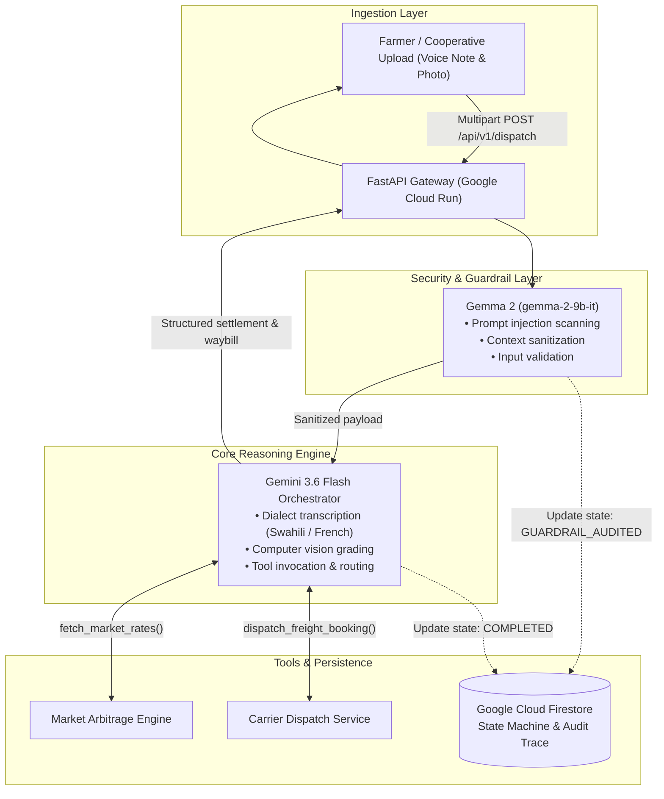

# KilimoAgent — Multimodal Agricultural Arbitrage & Logistics Dispatch Agent

KilimoAgent is an autonomous agent system engineered to eliminate intermediaries and optimize supply chain economics for smallholder agricultural cooperatives. The platform processes raw field media (voice notes and harvest photography), assesses crop quality, evaluates real-time market arbitrage across regional trade hubs, and books freight logistics directly with carriers without requiring manual intervention.

---

## Architecture Overview



---

## Core System Capabilities

* **Unbiased Multimodal Perception:** The agent does not rely on textual declarations. It derives volume and geographic origin directly from spoken audio (including Swahili accents and vernacular phrasing) and evaluates grain condition (moisture, defects, grading) strictly from harvest photography.
* **Dual-Model Security Pipeline:** Incoming requests pass through a security audit executed by `gemma-2-9b-it` to sanitize inputs and mitigate prompt injection attempts before reaching the primary orchestration layer.
* **Deterministic Arbitrage Routing:** The system calculates net revenue by subtracting dynamically estimated logistics costs from hub spot prices:

$$\text{Net Revenue} = (\text{Batch Volume} \times \text{Spot Price}) - \text{Freight Cost}$$


* **Transactional State Management:** Every request lifecycle is tracked in Google Cloud Firestore across defined stages (`INITIALIZED`, `GUARDRAIL_AUDITED`, `RUNNING_PIPELINE`, `COMPLETED`), maintaining an audit log and assigning collision-resistant transaction IDs.

---

## Technology Stack

* **Foundation Models:**
* `gemini-3.6-flash` (Primary multimodal orchestration and function calling)
* `gemma-2-9b-it` (Pre-execution guardrail and sanitization)


* **Application Framework:** Python 3.12, FastAPI, Uvicorn, Google GenAI Enterprise SDK
* **Google Cloud Infrastructure:**
* **Cloud Run:** Managed serverless execution environment
* **Cloud Firestore:** Distributed state persistence and audit ledger
* **Artifact Registry & Cloud Build:** Container compilation and packaging


---

## Repository Structure

```text
.
├── backend/
│   ├── assets/
│   │   ├── audios/            # Test voice notes (.mp4, .mp3)
│   │   └── images/            # Test harvest media (.jpg, .png)
│   ├── guardrails/
│   │   └── gemma_guard.py     # Gemma-based safety and sanitization module
│   ├── state/
│   │   └── firestore_manager.py # Firestore transaction and state management
│   ├── tools/
│   │   └── market_and_logistics.py # Arbitrage pricing and logistics dispatch tools
│   ├── agent.py               # Gemini orchestration pipeline and CLI runner
│   ├── main.py                # FastAPI HTTP application
│   ├── Dockerfile             # Container definition for Cloud Run
│   ├── .dockerignore          # Build context exclusions
│   └── requirements.txt       # Project dependencies
└── README.md

```

---

## Local Setup and Execution

### 1. Prerequisites

* Python 3.12 or higher
* Active Google Cloud Project with Cloud Run and Firestore APIs enabled
* Google Cloud SDK (`gcloud`) installed and authenticated

### 2. Environment Configuration

Clone the repository and prepare the virtual environment:

```bash
git clone [https://github.com/](https://github.com/)<your-username>/kilimo-agent.git
cd kilimo-agent/backend

python3 -m venv venv
source venv/bin/activate
pip install -r requirements.txt

```

Create a `.env` file in the `backend/` directory:

```env
GOOGLE_CLOUD_PROJECT=kilimoagent
GOOGLE_CLOUD_LOCATION=global

```

### 3. Running the Interactive CLI

The interactive command-line interface allows testing multimodal inputs locally without web server overhead:

```bash
python agent.py

```

### 4. Running the API Server

Start the local FastAPI service:

```bash
uvicorn main:app --host 0.0.0.0 --port 8080 --reload

```

Interactive API documentation will be available at `http://localhost:8080/docs`.

---

## Cloud Deployment

To package and deploy the service directly to Google Cloud Run:

```bash
cd backend
gcloud run deploy kilimo-backend \
  --source . \
  --region us-central1 \
  --allow-unauthenticated \
  --set-env-vars GOOGLE_CLOUD_PROJECT=kilimoagent,GOOGLE_CLOUD_LOCATION=global

```

---

## Verification and Execution Ledger Sample

Below is an authentic sample of the execution ledger returned by the agent upon processing an unannotated image and a Swahili voice recording:

```text
### Execution Ledger: Transaction FARMER-LDZB4JBW

1. Audio Extraction & Verification
* Spoken Transcribed Excerpt: "Habari KilimoAgent, niko hapa Bunia depot na gunia za mahindi. Kilo 1,500..."
* Declared Commodity: Maize (Zea mays)
* Extracted Weight: 1,500.0 kg
* Origin Location: Bunia Depot

2. Visual Crop Quality Assessment
* Identified Specimen: Yellow/Flint Maize
* Physical Characteristics: Intact kernel rows, fully dried husks, zero pest infestation detected.
* Quality Classification: Grade A Standard

3. Market Arbitrage Evaluation
* Border Trade Zone: $0.45/kg -> Gross: $675.00 | Freight: $60.00 | Net: $615.00 [SELECTED]
* Coastal Terminal:  $0.42/kg -> Gross: $630.00 | Suboptimal
* Central Market:    $0.38/kg -> Gross: $570.00 | Suboptimal

4. Freight Dispatch Confirmation
* Booking Status: DISPATCH_CONFIRMED
* Carrier Fleet: East-West AgroLogistics
* Waybill ID: KILIMO-WB-63F15ADA
* Destination: Border Trade Zone
* Estimated Transit Duration: 6 Hours
* Net Farmer Payout: $615.00 USD

```

---

## License

Distributed under the Apache 2.0 License. See `LICENSE` for further details.