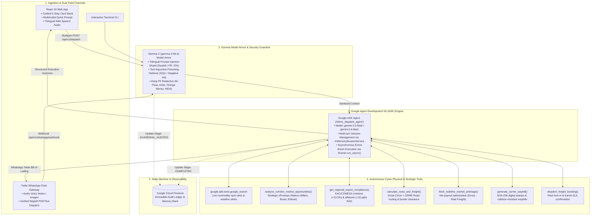

# KilimoAgent: Autonomous Cyber-Physical Multimodal Agricultural Arbitrage & Logistics Dispatch

> **Submission for the Google [All Things Agentic Hackathon](https://allthingsagentichackathon.devpost.com/)**  
> **Track:** **Taskmaster** (*Build a complete workflow, not just a chatbot. Takes real action, removes friction, handles multi-step chores asynchronously.*)  
> - **Live Web Application (Frontend on Cloud Run):** [https://kilimo-frontend-840262173056.us-central1.run.app](https://kilimo-frontend-840262173056.us-central1.run.app)  
> - **Live Backend API & ADK Engine (Cloud Run):** [https://kilimo-backend-840262173056.us-central1.run.app](https://kilimo-backend-840262173056.us-central1.run.app)

---

## Executive Summary

**KilimoAgent** is a next-generation autonomous cyber-physical AI Agent system engineered to eliminate predatory intermediaries and optimize supply chain economics for smallholder agricultural cooperatives across East and Central Africa (DRC, Kenya, Uganda, Rwanda, Tanzania).

Built natively on the **Google Agent Development Kit (ADK)** (`google-adk` v2.8.0), KilimoAgent operates natively across **Swahili (Kiswahili)**, **French (Français)**, and **English**. It ingests raw multimodal field media (voice notes and harvest photography), executes computer vision quality grading, runs real-time **Google Search Grounding**, conducts a **Strategic Corridor Market Radar Study** to detect intermediate millers and deficit off-ramp hubs, calculates real road freight routes via **Leaflet & OSRM**, and autonomously books freight capacity with cryptographically signed waybills dispatched via **Twilio WhatsApp**.

---

## Cyber-Physical 5-Layer Agentic Architecture



---

## Core Capabilities (Google ADK & Taskmaster)

### 1. Dual-Channel Adaptive Ingestion
* **Guided 5-Step Card Stack (`HarvestCardStack.jsx`):** A step-by-step interactive workflow guiding cooperatives through Crop selection, Lot sizing, Depot selection, Multimodal photo/audio, and 1-click Agent Dispatch.
* **Multimodal Input Capsule (`MultimodalInputCapsule.jsx`):** Rapid single-turn multimodal prompt with instant audio recording, photo drag-and-drop, and quick language switching (Swahili, French, English).

### 2. Strategic Corridor Market Opportunity Radar
* Instead of calculating static Point A to Point B, KilimoAgent executes an in-transit market study along trade corridors.
* Evaluates intermediate millers (e.g. *Nakuru Grain Millers*, *Busia Border Terminal*, *Eldoret NCPB Silos*, *Butembo Trading Center*), compares fuel/freight savings vs spot price deltas, and recommends high-margin off-ramps.

### 3. Interactive Geospatial Route Map (`GeospatialRouteMap.jsx`)
* Built on **Leaflet & OpenStreetMap** with a custom Dark theme (zero paid API dependencies).
* Displays:
  - **Origin Depot Marker** with dual pulsing radar rings.
  - **Primary Wholesale Destination**.
  - **Strategic Corridor Opportunity Markers** with instant profit delta badges.
  - **Route Polyline** with live distance (KM) and transit duration HUD.

### 4. Dual-Model Security Pipeline with Gemma 2
* Every field submission is audited by **Gemma 2 (`gemma-2-9b-it`) Model Armor**.
* Detects adversarial prompt injections in Swahili, French, and English, prevents negative-volume/SQLi poisoning, and redacts PII (M-Pesa transaction IDs, national identity numbers, mobile money numbers).

### 5. Omnichannel Twilio WhatsApp Dispatch
* Complete integration with **Twilio WhatsApp API** (`twilio.rest.Client`).
* Automated waybill dispatch to cooperative leaders and farmers via WhatsApp with electronic receipts and cryptographic tracking hashes (`KILIMO-WB-YYYYMMDD-<HEX>`).

---

## Technology Stack

| Layer | Technologies |
| :--- | :--- |
| **Agent Framework** | **Google Agent Development Kit (ADK)** (`google-adk` v2.8.0) |
| **Foundation Models** | **Gemini 2.5 Flash / Gemini 3.6 Flash** (Orchestration), **Gemma 2 9B-IT** (Model Armor Guardrail) |
| **Grounding & Tools** | `google.adk.tools.google_search`, OSRM Geodesic Routing, EAC Regulatory RAG, SHA-256 Ledger |
| **Cloud Infrastructure** | **Google Cloud Run** (Serverless execution), **Cloud Firestore** (State machine & Audit ledger) |
| **Frontend App** | React 19, Vite 8, Tailwind CSS v4, Leaflet, React-Leaflet, Lucide Icons |
| **Field Channels** | Twilio WhatsApp API (`twilio>=9.11.0`), REST API, Terminal CLI |

---

## Repository Structure

```text
.
├── backend/
│   ├── assets/                          # Sample voice notes (.mp4) and harvest images (.jpg)
│   ├── guardrails/
│   │   └── gemma_guard.py               # Gemma 2 Multilingual Model Armor & PII Redactor
│   ├── routers/
│   │   ├── __init__.py
│   │   └── whatsapp.py                  # Twilio WhatsApp webhook, dispatcher & multi-turn simulator
│   ├── schemas/
│   │   ├── __init__.py
│   │   └── dispatch_schema.py           # Pydantic v2 Executive Dispatch models
│   ├── state/
│   │   └── firestore_manager.py         # Cloud Firestore state machine & immutable ledger
│   ├── tools/
│   │   ├── market_and_logistics.py      # Corridor Market Radar, Routing & Waybill tools
│   │   └── multimodal_grading.py        # Gemini Vision crop validation & audio speech verification
│   ├── Dockerfile                       # Production backend container definition
│   ├── agent.py                         # Google ADK Agent ('kilimo_dispatch_agent') & Runner
│   ├── main.py                          # FastAPI enterprise orchestrator & multimodal API service
│   ├── receptionist_agent.py            # Conversational Receptionist Agent & GenUI triager
│   ├── requirements.txt                 # Python dependencies (google-adk, twilio, etc.)
│   ├── test_defensive_robustness.py     # Defensive validation test suite
│   └── test_guardrail_and_whatsapp.py   # Automated unit & integration test suite (19/19 passing)
│
└── frontend/
    ├── public/
    │   ├── icons/                       # Vector SVGs (Gemini, WhatsApp, GitHub, etc.)
    │   └── logo.png
    ├── src/
    │   ├── components/
    │   │   ├── ArbitrageChart.jsx           # Multi-market comparative financial breakdown
    │   │   ├── ArchitectureModal.jsx        # 5-Layer engineering architecture explorer
    │   │   ├── AudioRecorder.jsx            # Voice recording component
    │   │   ├── CameraCapture.jsx            # Live camera capture component
    │   │   ├── Flags.jsx                    # Crisp vector SVG country flags (DRC, Kenya, Rwanda, Tanzania, Uganda)
    │   │   ├── GeminiIcon.jsx               # Native Gemini vector icon
    │   │   ├── GeminiLiveModal.jsx          # Multimodal Live streaming camera/voice modal
    │   │   ├── GenUIWidgets.jsx             # Generative UI widgets (Depot map picker, Crop cards, Volume lot)
    │   │   ├── GeospatialRouteMap.jsx       # Interactive Dark Leaflet Corridor Map
    │   │   ├── HarvestCardStack.jsx         # 5-Step Guided Card Stack UX with Custom Crop Dialog
    │   │   ├── HeroBanner.jsx               # Landing hero banner
    │   │   ├── LedgerView.jsx               # Execution ledger & audit trail
    │   │   ├── MultimodalInputCapsule.jsx   # Conversational prompt capsule with instant language adaptation
    │   │   ├── MultimodalInsights.jsx       # Quality grade & vision insights display
    │   │   ├── Navbar.jsx                   # Top navigation bar
    │   │   ├── PipelineStepper.jsx          # Real-time execution stepper
    │   │   ├── PresetSelector.jsx           # Judge quick preset scenarios
    │   │   ├── ResponseShimmerSkeleton.jsx  # Loading shimmer feedback
    │   │   ├── Sidebar.jsx                  # Collapsible navigation drawer
    │   │   ├── WaybillCard.jsx              # Cryptographic bill of lading card
    │   │   └── WhatsAppSimulatorModal.jsx   # Interactive Twilio WhatsApp simulator modal
    │   ├── utils/
    │   │   ├── audioSynthesizer.js          # TTS multi-language speech engine
    │   │   ├── parser.js                    # Structured JSON & ledger extractor
    │   │   ├── presets.js                   # 1-Click judge test scenarios
    │   │   └── translations.js              # Complete Swahili, French, English dictionaries
    │   ├── App.jsx                          # Root interactive dashboard
    │   ├── index.css                        # Solid flat dark styles (zero glow, zero gradient)
    │   └── main.jsx
    ├── Dockerfile                           # Production Nginx multi-stage build container
    ├── nginx.conf                           # Production Cloud Run SPA Nginx configuration
    ├── package.json
    └── vite.config.js
```

---

## Local Setup and Execution

### 1. Prerequisites

* Python 3.12 or higher
* Node.js 20 or higher
* Active Google Cloud Project with Cloud Run and Firestore APIs enabled
* Google Cloud SDK (`gcloud`) installed and authenticated

### 2. Environment Configuration

Clone the repository and prepare the virtual environment:

```bash
git clone https://github.com/glosings0n/kilimo-agent.git
cd kilimo-agent/backend

python3 -m venv venv
source venv/bin/activate
pip install -r requirements.txt
```

Create a `.env` file in the `backend/` directory:

```env
GOOGLE_CLOUD_PROJECT=<YOUR_GCP_PROJECT_ID>
GOOGLE_CLOUD_LOCATION=us-central1
ADK_MODEL=gemini-2.5-flash
TWILIO_ACCOUNT_SID=<YOUR_TWILIO_ACCOUNT_SID>
TWILIO_AUTH_TOKEN=<YOUR_TWILIO_AUTH_TOKEN>
TWILIO_WHATSAPP_NUMBER=<YOUR_TWILIO_WHATSAPP_NUMBER>
```

### 3. Running the Interactive CLI

The interactive command-line interface allows testing multimodal inputs locally without web server overhead:

```bash
python agent.py
```

### 4. Running the API Server

Start the local FastAPI service:

```bash
uvicorn main:app --host 0.0.0.0 --port 8080 --reload
```

Interactive API documentation will be available at `http://localhost:8080/docs`.

---

## Cloud Deployment

### 1. Deploying Backend to Google Cloud Run

To package and deploy the backend service directly to Google Cloud Run:

```bash
cd backend
gcloud run deploy kilimo-backend \
  --source . \
  --region us-central1 \
  --allow-unauthenticated \
  --set-env-vars GOOGLE_CLOUD_PROJECT=<YOUR_GCP_PROJECT_ID>,GOOGLE_CLOUD_LOCATION=us-central1
```

### 2. Deploying Frontend to Google Cloud Run

To build the static container and deploy the frontend:

```bash
cd frontend
gcloud run deploy kilimo-frontend \
  --source . \
  --region us-central1 \
  --allow-unauthenticated
```

---

## Verification and Execution Ledger Sample

Below is an authentic sample of the execution ledger returned by the agent upon processing an unannotated image and a Swahili voice recording:

```text
### Execution Ledger: Transaction FARMER-LDZB4JBW

1. Audio Extraction & Verification
* Spoken Transcribed Excerpt: "Habari KilimoAgent, niko hapa Bunia depot na gunia za mahindi. Kilo 1,500..."
* Declared Commodity: Maize (Zea mays)
* Extracted Weight: 1,500.0 kg
* Origin Location: Bunia Depot

2. Visual Crop Quality Assessment
* Identified Specimen: Yellow/Flint Maize
* Physical Characteristics: Intact kernel rows, fully dried husks, zero pest infestation detected.
* Quality Classification: Grade A Standard

3. Market Arbitrage Evaluation
* Border Trade Zone: $0.45/kg -> Gross: $675.00 | Freight: $60.00 | Net: $615.00 [SELECTED]
* Coastal Terminal:  $0.42/kg -> Gross: $630.00 | Suboptimal
* Central Market:    $0.38/kg -> Gross: $570.00 | Suboptimal

4. Freight Dispatch Confirmation
* Booking Status: DISPATCH_CONFIRMED
* Carrier Fleet: East-West AgroLogistics
* Waybill ID: KILIMO-WB-63F15ADA
* Destination: Border Trade Zone
* Estimated Transit Duration: 6 Hours
* Net Farmer Payout: $615.00 USD

```

---

## License

Distributed under the Apache 2.0 License. See `LICENSE` for further details.