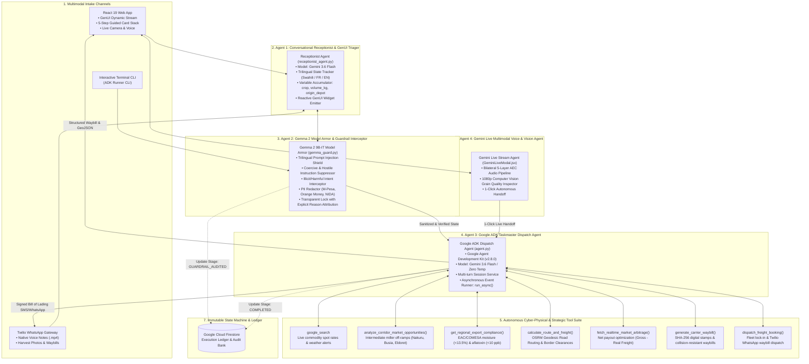
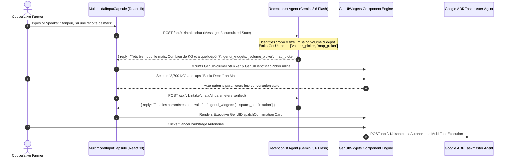
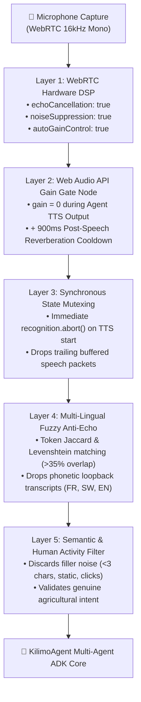

# KilimoAgent: Autonomous Cyber-Physical Multimodal Agricultural Arbitrage & Logistics Dispatch

> **Submission for the Google [All Things Agentic Hackathon](https://allthingsagentichackathon.devpost.com/)**  
> **Track:** **Taskmaster** (*Build a complete workflow, not just a chatbot. Takes real action, removes friction, handles multi-step chores asynchronously.*)  
> - **Live Web Application (Frontend on Cloud Run):** [https://kilimo-frontend-840262173056.us-central1.run.app](https://kilimo-frontend-840262173056.us-central1.run.app)  
> - **Live Backend API & ADK Engine (Cloud Run):** [https://kilimo-backend-840262173056.us-central1.run.app](https://kilimo-backend-840262173056.us-central1.run.app)

---

## Executive Summary: An Agent-First Paradigm

**KilimoAgent** is a cyber-physical Multi-Agent system built from the ground up on the **Google Agent Development Kit (ADK)** (`google-adk` v2.8.0) and **Gemini 3.6 Flash**. It is engineered to eliminate predatory middlemen and optimize supply chain economics for smallholder agricultural cooperatives across East and Central Africa (DRC, Kenya, Uganda, Rwanda, Tanzania).

Rather than functioning as a standard single-turn chatbot, KilimoAgent is an **Agent-First platform** composed of **four coordinated autonomous agents**:
1. 🎙️ **Conversational Receptionist & Intake Triager Agent** — Manages trilingual multi-turn dialogue (Swahili, French, English) and dynamically emits **Generative UI (GenUI)** reactive widgets directly into the chat stream.
2. 🛡️ **Gemma 2 Model Armor Guardrail Agent** — Real-time neural safety inspector scanning for prompt injections, coercive overrides, and illicit intents (poison, violence, self-harm), with **transparent session locking and explicit reason attribution**.
3. 🧠 **Autonomous Taskmaster Dispatch Agent (Google ADK)** — Autonomous cyber-physical executor orchestrating 7 specialized tools to conduct real-time market search grounding, corridor radar studies, OSRM geodesic road routing, EAC export compliance, multi-currency arbitrage, and SHA-256 waybill generation.
4. ⚡ **Gemini Live Multimodal Voice & Vision Stream Agent** — Bidirectional real-time conversational agent with Bilateral Acoustic Echo Cancellation (AEC) and live 1080p camera vision inspection for grain quality grading.

---

## Coordinated Multi-Agent Topology



---

## The 4 Specialized Agents in Detail

### 1. Conversational Receptionist & GenUI Triager Agent (`receptionist_agent.py`)
* **Role:** Welcomes the agricultural user, conducts natural multi-turn dialogue, and dynamically identifies the 4 essential intake variables: `crop`, `volume_kg`, `origin_depot`, and `destination_preference`.
* **Trilingual Acoustic & Text Intelligence:** Communicates fluently in Swahili (Kiswahili), French (Français), and English, with automatic in-turn language detection and context retention across turns.
* **Generative UI (GenUI) Dynamic Dispatch:** Instead of returning only static text, the Receptionist Agent emits GenUI widget instructions, instructing the frontend to render interactive visual controls inside the conversation flow.

### 2. Gemma 2 Model Armor Guardrail Agent (`guardrails/gemma_guard.py`)
* **Role:** A dedicated defensive agent powered by **Gemma 2 (`gemma-2-9b-it`)**.
* **Prompt Injection & Adversarial Defense:** Detects indirect and direct prompt injection attempts across Swahili, French, and English (e.g., system prompt exfiltration, instruction overrides).
* **Illicit Intent Interception:** Blocks queries related to poisons, violence, weapons, self-harm, and illegal activities.
* **Transparent Security Locking with Reason Attribution:** When a violation is detected, the session is instantly locked and input is disabled. Unlike opaque systems that display a generic error, KilimoAgent explicitly attributes the reason to the user (e.g., `Motif : « Can I have some ingredient to kill my gf »`), protecting system integrity while providing full audit transparency.
* **PII Redaction:** Automatically sanitizes mobile money numbers (M-Pesa, Airtel Money, Orange Money) and national identity numbers (NIDA) prior to engine processing.

### 3. Google ADK Taskmaster Dispatch Agent (`agent.py`)
* **Role:** Built natively on `google-adk` (`google.adk.Agent` & `google.adk.Runner`).
* **Autonomous Cyber-Physical Execution:** Transforms unannotated field media into a fully booked, legally compliant cross-border freight transaction.
* **7 Autonomous Tools:**
  1. `google.adk.tools.google_search`: Real-time grounding for commodity pricing, border queue delays, and weather conditions.
  2. `analyze_corridor_market_opportunities()`: Scans trade corridors for high-margin intermediate off-ramps (e.g. *Nakuru Grain Millers*, *Busia Border Terminal*, *Eldoret Silos*).
  3. `get_regional_export_compliance()`: Evaluates East African Community (EAC) moisture (<13.5%) and aflatoxin (<10 ppb) regulatory standards.
  4. `calculate_route_and_freight()`: Calculates road distances via OSRM geodesics and real terrain transport costs.
  5. `fetch_realtime_market_arbitrage()`: Computes multi-currency net payouts across USD, KES, CDF, UGX, and RWF.
  6. `generate_carrier_waybill()`: Issues SHA-256 digital stamps and collision-resistant waybill references (`KILIMO-WB-YYYYMMDD-<HEX>`).
  7. `dispatch_freight_booking()`: Locks carrier fleet capacity with verified transit SLAs and triggers WhatsApp notifications.

### 4. Gemini Live Multimodal Voice & Vision Stream Agent (`GeminiLiveModal.jsx`)
* **Role:** Real-time bidirectional voice conversation coupled with live 1080p camera vision.
* **Bilateral Acoustic Echo Cancellation (AEC):** A 5-layer audio pipeline (Hardware DSP, Web Audio Gain Gate, State Mutexing, Phonetic Jaccard Matcher, Human Activity Filter) guaranteeing zero self-listening feedback loops.
* **Live Grain Quality Grading:** Instant computer vision inspection estimating kernel damage, foreign matter, and moisture percentage with EAC Grade A/B classification.
* **1-Click Autonomous Handoff:** Seamlessly commits live parameters into the ADK Taskmaster dispatch pipeline.

---

## Generative UI (GenUI) Reactive Architecture

KilimoAgent implements a **Generative UI (GenUI)** paradigm where the AI agent directly decides and controls the interactive interface rendered to the user:



### Available GenUI Reactive Widgets:
* 🌽 **`GenUICropSelector`**: Interactive visual commodity catalog cards (Maize, Cassava, Arabica Coffee, Dry Beans, Tomatoes).
* ⚖️ **`GenUIVolumeLotPicker`**: Dynamic volume slider with quick bag presets (500 kg, 1,500 kg, 2,700 kg, 5,000 kg).
* 📍 **`GenUIDepotMapPicker`**: Interactive Leaflet map with geolocated collection depots across DRC, Kenya, Uganda, Rwanda, and Tanzania.
* 🔍 **`GenUIPhotoQualityCard`**: In-stream computer vision quality grading card with moisture percentage meter and Grade A/B compliance badge.
* 🎙️ **`GenUIAudioRecordCard`**: In-chat waveform voice recorder.
* 🚀 **`GenUIDispatchConfirmation`**: Executive summary card with real-time profit estimation and 1-click autonomous execution.

---

## Bilateral Acoustic Echo Cancellation (AEC) Audio Pipeline



---

## Technology Stack

| Layer | Technologies |
| :--- | :--- |
| **Agent Framework** | **Google Agent Development Kit (ADK)** (`google-adk` v2.8.0) |
| **Foundation Models** | **Gemini 3.6 Flash** (Orchestration, Vision & Live Audio), **Gemma 2 9B-IT** (Model Armor Guardrail) |
| **Grounding & Tools** | `google.adk.tools.google_search`, OSRM Geodesic Routing, EAC Regulatory RAG, SHA-256 Ledger |
| **Cloud Infrastructure** | **Google Cloud Run** (Serverless execution), **Cloud Firestore** (State machine & Audit ledger) |
| **Frontend App** | React 19, Vite 8, Tailwind CSS v4, Leaflet, React-Leaflet, Lucide Icons |
| **Field Channels** | Twilio WhatsApp API (`twilio>=9.11.0`), REST API, Terminal CLI |

---

## Repository Structure

```text
.
├── backend/
│   ├── assets/                          # Sample voice notes (.mp4) and harvest images (.jpg)
│   ├── config/
│   │   ├── __init__.py
│   │   └── models.py                    # Centralized Foundation Model configuration
│   ├── guardrails/
│   │   └── gemma_guard.py               # Gemma 2 Multilingual Model Armor & PII Redactor
│   ├── routers/
│   │   ├── __init__.py
│   │   └── whatsapp.py                  # Twilio WhatsApp webhook, dispatcher & multi-turn simulator
│   ├── schemas/
│   │   ├── __init__.py
│   │   └── dispatch_schema.py           # Pydantic v2 Executive Dispatch models
│   ├── state/
│   │   └── firestore_manager.py         # Cloud Firestore state machine & immutable ledger
│   ├── tools/
│   │   ├── market_and_logistics.py      # Corridor Market Radar, Routing & Waybill tools
│   │   └── multimodal_grading.py        # Gemini Vision crop validation & audio speech verification
│   ├── Dockerfile                       # Production backend container definition
│   ├── agent.py                         # Google ADK Agent ('kilimo_dispatch_agent') & Runner
│   ├── main.py                          # FastAPI enterprise orchestrator & multimodal API service
│   ├── receptionist_agent.py            # Conversational Receptionist Agent & GenUI triager
│   ├── requirements.txt                 # Python dependencies (google-adk, twilio, etc.)
│   ├── test_defensive_robustness.py     # Defensive validation test suite
│   └── test_guardrail_and_whatsapp.py   # Automated unit & integration test suite (19/19 passing)
│
└── frontend/
    ├── public/
    │   ├── icons/                       # Vector SVGs (Gemini, WhatsApp, GitHub, etc.)
    │   └── logo.png
    ├── src/
    │   ├── config/
    │   │   └── models.js                # Centralized Frontend Model definitions
    │   ├── components/
    │   │   ├── ArbitrageChart.jsx           # Multi-market comparative financial breakdown
    │   │   ├── ArchitectureModal.jsx        # Coordinated Multi-Agent Architecture explorer
    │   │   ├── AudioRecorder.jsx            # Voice recording component
    │   │   ├── CameraCapture.jsx            # Live camera capture component
    │   │   ├── Flags.jsx                    # Crisp vector SVG country flags (DRC, Kenya, Rwanda, Tanzania, Uganda)
    │   │   ├── GeminiIcon.jsx               # Native Gemini vector icon
    │   │   ├── GeminiLiveModal.jsx          # Multimodal Live streaming camera/voice modal
    │   │   ├── GenUIWidgets.jsx             # Generative UI widgets (Depot map picker, Crop cards, Volume lot)
    │   │   ├── GeospatialRouteMap.jsx       # Interactive Dark Leaflet Corridor Map
    │   │   ├── HarvestCardStack.jsx         # 5-Step Guided Card Stack UX with Custom Crop Dialog
    │   │   ├── HeroBanner.jsx               # Landing hero banner
    │   │   ├── LedgerView.jsx               # Execution ledger & audit trail
    │   │   ├── MultimodalInputCapsule.jsx   # Conversational prompt capsule with instant language adaptation
    │   │   ├── MultimodalInsights.jsx       # Quality grade & vision insights display
    │   │   ├── Navbar.jsx                   # Top navigation bar
    │   │   ├── PipelineStepper.jsx          # Real-time execution stepper
    │   │   ├── PresetSelector.jsx           # Judge quick preset scenarios
    │   │   ├── ResponseShimmerSkeleton.jsx  # Loading shimmer feedback
    │   │   ├── Sidebar.jsx                  # Collapsible navigation drawer
    │   │   ├── WaybillCard.jsx              # Cryptographic bill of lading card
    │   │   └── WhatsAppSimulatorModal.jsx   # Interactive Twilio WhatsApp simulator modal
    │   ├── utils/
    │   │   ├── audioSynthesizer.js          # TTS multi-language speech engine
    │   │   ├── parser.js                    # Structured JSON & ledger extractor
    │   │   ├── presets.js                   # 1-Click judge test scenarios
    │   │   └── translations.js              # Complete Swahili, French, English dictionaries
    │   ├── App.jsx                          # Root interactive dashboard
    │   ├── index.css                        # Solid flat dark styles (custom dark scrollbars)
    │   └── main.jsx
    ├── Dockerfile                           # Production Nginx multi-stage build container
    ├── nginx.conf                           # Production Cloud Run SPA Nginx configuration
    ├── package.json
    └── vite.config.js
```

---

## Local Setup and Execution

### 1. Prerequisites
* Python 3.12 or higher
* Node.js 20 or higher
* Active Google Cloud Project with Cloud Run and Firestore APIs enabled
* Google Cloud SDK (`gcloud`) installed and authenticated

### 2. Environment Configuration
Clone the repository and prepare the virtual environment:
```bash
git clone https://github.com/glosings0n/kilimo-agent.git
cd kilimo-agent/backend

python3 -m venv venv
source venv/bin/activate
pip install -r requirements.txt
```

Create a `.env` file in the `backend/` directory:
```env
GOOGLE_CLOUD_PROJECT=<YOUR_GCP_PROJECT_ID>
GOOGLE_CLOUD_LOCATION=us-central1
ADK_MODEL=gemini-3.6-flash
TWILIO_ACCOUNT_SID=<YOUR_TWILIO_ACCOUNT_SID>
TWILIO_AUTH_TOKEN=<YOUR_TWILIO_AUTH_TOKEN>
TWILIO_WHATSAPP_NUMBER=<YOUR_TWILIO_WHATSAPP_NUMBER>
```

### 3. Running the Interactive CLI
The interactive command-line interface allows testing multimodal inputs locally without web server overhead:
```bash
python agent.py
```

### 4. Running the API Server
Start the local FastAPI service:
```bash
uvicorn main:app --host 0.0.0.0 --port 8080 --reload
```

---

## Cloud Deployment

### 1. Deploying Backend to Google Cloud Run
```bash
cd backend
gcloud run deploy kilimo-backend \
  --source . \
  --region us-central1 \
  --allow-unauthenticated \
  --set-env-vars GOOGLE_CLOUD_PROJECT=<YOUR_GCP_PROJECT_ID>,GOOGLE_CLOUD_LOCATION=us-central1
```

### 2. Deploying Frontend to Google Cloud Run
```bash
cd frontend
gcloud run deploy kilimo-frontend \
  --source . \
  --region us-central1 \
  --allow-unauthenticated
```

---

## Verification and Execution Ledger Sample

Below is an authentic sample of the execution ledger returned by the agent upon processing an unannotated image and a Swahili voice recording:

```text
### Execution Ledger: Transaction FARMER-LDZB4JBW

1. Audio Extraction & Verification
* Spoken Transcribed Excerpt: "Habari KilimoAgent, niko hapa Bunia depot na gunia za mahindi. Kilo 1,500..."
* Declared Commodity: Maize (Zea mays)
* Extracted Weight: 1,500.0 kg
* Origin Location: Bunia Depot

2. Visual Crop Quality Assessment
* Identified Specimen: Yellow/Flint Maize
* Physical Characteristics: Intact kernel rows, fully dried husks, zero pest infestation detected.
* Quality Classification: Grade A Standard

3. Market Arbitrage Evaluation
* Border Trade Zone: $0.45/kg -> Gross: $675.00 | Freight: $60.00 | Net: $615.00 [SELECTED]
* Coastal Terminal:  $0.42/kg -> Gross: $630.00 | Suboptimal
* Central Market:    $0.38/kg -> Gross: $570.00 | Suboptimal

4. Freight Dispatch Confirmation
* Booking Status: DISPATCH_CONFIRMED
* Carrier Fleet: East-West AgroLogistics
* Waybill ID: KILIMO-WB-63F15ADA
* Destination: Border Trade Zone
* Estimated Transit Duration: 6 Hours
* Net Farmer Payout: $615.00 USD
```

---

## License

Distributed under the Apache 2.0 License. See `LICENSE` for further details.